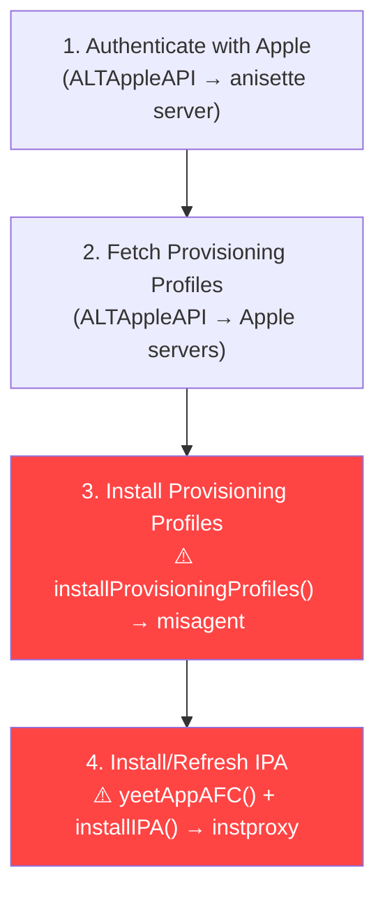

# Bypassing SideStore's LocalDevVPN with RemoteCall

## The Problem: Why Does SideStore Need the VPN?

After deep-diving into the entire refresh pipeline, here's the exact flow and where the VPN dependency lives:



### The Pipeline Breakdown

| Stage | What It Does | Needs VPN? | Why? |
|-------|-------------|-----------|------|
| **Authentication** | Talks to Apple's auth servers via HTTPS | ❌ No | Regular network |
| **Fetch Profiles** | Downloads provisioning profiles from Apple | ❌ No | Regular network |
| **Install Profiles** | Calls `Minimuxer.installProvisioningProfile()` | ✅ **YES** | Talks to `misagent` daemon via lockdownd |
| **Send App (AFC)** | Calls `Minimuxer.yeetAppAfc()` | ✅ **YES** | Talks to `AFC` service via lockdownd |
| **Install App** | Calls `Minimuxer.installIpa()` | ✅ **YES** | Talks to `instproxy` service via lockdownd |

**The VPN (minimuxer) creates a loopback connection** that pretends to be a USB tunnel so the app can talk to `lockdownd` → `misagent` / `instproxy` / `AFC` services. These are system daemons that manage provisioning profiles and app installation.

> [!IMPORTANT]
> For a **refresh** (not a fresh install), SideStore only needs stages 1-3. It fetches new profiles and installs them via misagent. It does NOT need to re-send the IPA via AFC or reinstall via instproxy. The critical code is in [RefreshAppOperation.swift](file:///Users/system/Documents/test/SideStore-develop/AltStore/Operations/RefreshAppOperation.swift#L49-L54):
> ```swift
> for p in profiles {
>     try installProvisioningProfiles(p.value.data)  // ← THIS IS THE VPN DEPENDENCY
>     // Then just updates the DB with new profile dates
> }
> ```

---

## Bypass Approaches

### Approach 1: Direct `misagent` Bypass via RemoteCall (Best for Refresh)

**Concept:** Use RemoteCall to target a process that already has access to `misagent` (like `SpringBoard` or `installd`) and call the profile installation APIs directly, completely skipping minimuxer's USB tunnel.

The `misagent` daemon manages provisioning profiles. On iOS, the private C functions to interact with it are:
- `MISProfileInstallProvisioningProfile(CFDataRef profileData)` 
- `MISProfileRemoveProvisioningProfile(CFStringRef profileID)`
- `MISProfileCopyInstalledProvisioningProfiles()`

These live in `MobileInstallation.framework` / `libmis.dylib`.

**Code (in lara's `rc.m`):**

```objc
// Install a provisioning profile by directly calling misagent APIs
// from SpringBoard's context (which has the entitlements to do so)
int rc_install_provisioning_profile(RemoteCall *proc, NSData *profileData) {
    if (!proc) {
        printf("(rc) RemoteCall not initialized\n");
        return -1;
    }
    
    uint64_t mem = proc.trojanMem;
    
    // Load MobileInstallation framework in SpringBoard if not already loaded
    proc[mem].string = @"/System/Library/PrivateFrameworks/MobileInstallation.framework/MobileInstallation";
    RemoteArbCall(proc, dlopen, mem, RTLD_NOW);
    
    // Get the function pointer for MISProfileInstallProvisioningProfile
    void *MIS_install = dlsym(RTLD_DEFAULT, "MISProfileInstallProvisioningProfile");
    if (!MIS_install) {
        printf("(rc) MISProfileInstallProvisioningProfile not found locally, trying via remote dlsym\n");
        proc[mem].string = @"MISProfileInstallProvisioningProfile";
        uint64_t RTLD_DEFAULT_val = (uint64_t)-2;
        uint64_t remoteSym = RemoteArbCall(proc, dlsym, RTLD_DEFAULT_val, mem);
        if (!remoteSym) {
            printf("(rc) Could not find MISProfileInstallProvisioningProfile\n");
            return -2;
        }
    }
    
    // Allocate profile data in remote process
    uint64_t clsNSData = remote_getClass(proc, "NSData");
    uint64_t selDataWithBytes = remote_sel(proc, "dataWithBytes:length:");
    
    // Copy profile bytes into remote memory
    const void *bytes = profileData.bytes;
    NSUInteger length = profileData.length;
    
    // Write the profile data into the trojan memory region
    uint64_t dataAddr = mem + 0x1000; // offset past our string buffer
    [proc writeBytes:bytes length:length toAddress:dataAddr];
    
    // Create NSData in remote process
    uint64_t remoteData = remote_msg(proc, clsNSData, selDataWithBytes, dataAddr, (uint64_t)length, 0, 0);
    
    // Call MISProfileInstallProvisioningProfile(remoteData)
    // This function takes a CFDataRef (toll-free bridged with NSData)
    int result = (int)RemoteArbCall(proc, MIS_install, remoteData);
    
    printf("(rc) MISProfileInstallProvisioningProfile returned: %d\n", result);
    return result;
}
```

> [!WARNING]
> SpringBoard may or may not have the `com.apple.private.MobileInstallation.AllowedSPI` entitlement needed to call misagent directly. If it doesn't, we need to target a process that does, like `installd` itself.

### Approach 2: Wake Up `misagent` Directly and Talk to It

Lara already has `wake_up_daemon()` which can spin up any XPC/Mach service from SpringBoard. We can use this pattern to wake up `com.apple.misagent` and then init a RemoteCall session on it.

```swift
// In lara Swift wrapper
func refreshSideStoreProfiles(profilesData: [Data]) {
    let mgr = laramgr.shared
    guard mgr.rcready, let sbProc = mgr.sbProc else { return }
    
    // Option A: Use rcinitDaemon to connect to misagent
    mgr.rcinitDaemon(
        serviceName: "com.apple.misagent_sb",
        framework: nil,
        process: "misagent"
    ) { misagentProc in
        guard let misagentProc = misagentProc else {
            print("Failed to init RemoteCall on misagent")
            return
        }
        
        // Now we have code execution inside misagent
        // Call its internal profile install function
        for profileData in profilesData {
            let result = rc_install_provisioning_profile(misagentProc, profileData)
            print("Profile install result: \(result)")
        }
        
        misagentProc.destroy()
    }
}
```

### Approach 3: Hybrid — Let SideStore Handle Auth, Use RemoteCall for Install

This is the most **practical** approach. SideStore already handles Apple authentication and profile fetching just fine without the VPN. The VPN is ONLY needed at step 3 (`installProvisioningProfiles()`).

**Plan:**
1. **Modify SideStore** to save fetched profiles to disk instead of installing them immediately when VPN is unavailable
2. **Add a new lara action** that reads these saved profiles and installs them via RemoteCall → misagent
3. SideStore updates its DB with the new expiration dates

#### Step 1: Modify SideStore's RefreshAppOperation

```diff
// RefreshAppOperation.swift
 override func main() {
     // ... existing code ...
     for p in profiles {
         do {
-            try installProvisioningProfiles(p.value.data)
+            if isMinimuxerReady {
+                try installProvisioningProfiles(p.value.data)
+            } else {
+                // Save profile to shared location for external installation
+                let profileDir = FileManager.default.documentsDirectory
+                    .appendingPathComponent("PendingProfiles")
+                try FileManager.default.createDirectory(at: profileDir,
+                    withIntermediateDirectories: true)
+                let profileURL = profileDir
+                    .appendingPathComponent("\(p.key).mobileprovision")
+                try p.value.data.write(to: profileURL)
+                print("[RefreshAppOp] Saved profile for external install: \(p.key)")
+            }
         } catch {
             self.finish(.failure(MinimuxerError.ProfileInstall))
         }
         // ... rest of DB update code stays the same ...
     }
 }
```

#### Step 2: Add Profile Installer in lara

Add a new function in [rc.m](file:///Users/system/Documents/test/lara-main/lara/kexploit/pe/rc.m):

```objc
// rc.h
int rc_install_profiles_from_dir(RemoteCall *proc, const char *profilesDir);

// rc.m
int rc_install_profiles_from_dir(RemoteCall *proc, const char *profilesDirPath) {
    if (!proc) return -1;
    
    NSString *dir = [NSString stringWithUTF8String:profilesDirPath];
    NSArray *files = [[NSFileManager defaultManager] contentsOfDirectoryAtPath:dir error:nil];
    int installed = 0;
    
    for (NSString *file in files) {
        if (![file.pathExtension isEqualToString:@"mobileprovision"]) continue;
        
        NSString *path = [dir stringByAppendingPathComponent:file];
        NSData *data = [NSData dataWithContentsOfFile:path];
        if (!data) continue;
        
        int result = rc_install_provisioning_profile(proc, data);
        if (result == 0) {
            installed++;
            // Delete the pending profile after successful install
            [[NSFileManager defaultManager] removeItemAtPath:path error:nil];
        }
        printf("(rc) Installed %s: %d\n", file.UTF8String, result);
    }
    
    return installed;
}
```

#### Step 3: Add UI Button in lara

Add a section in [RemoteView.swift](file:///Users/system/Documents/test/lara-main/lara/views/tweaks/RemoteView.swift) or [ContentView.swift](file:///Users/system/Documents/test/lara-main/lara/views/app/ContentView.swift):

```swift
Section {
    Button("Refresh SideStore Profiles") {
        run("Install Pending Profiles") {
            // Find SideStore's Documents/PendingProfiles directory
            let appList = mgr.getAppList()
            guard let sideStoreInfo = appList?["com.SideStore.SideStore"] else {
                return "SideStore not found"
            }
            
            let profilesDir = "/private/var/mobile/Containers/Data/Application/"
                + sideStoreInfo.dataFolder 
                + "/Documents/PendingProfiles"
            
            let result = rc_install_profiles_from_dir(mgr.sbProc, profilesDir)
            return "Installed \(result) profiles"
        }
    }
} header: {
    Text("SideStore Refresh")
} footer: {
    Text("Install pending provisioning profiles without VPN. Run SideStore's refresh first to fetch profiles, then use this to install them.")
}
```

---

## Open Questions

> [!IMPORTANT]
> 1. **Which approach do you want to go with?**
>    - **Approach 1**: Pure RemoteCall → misagent (most direct, hardest to get right)
>    - **Approach 2**: Wake up misagent daemon via lara's existing pattern (medium difficulty)  
>    - **Approach 3**: Hybrid — modify SideStore to save profiles + lara installs them (easiest, most reliable)
> 2. **Do you have access to both SideStore and lara Xcode projects?** Approach 3 requires modifying both.
> 3. **What iOS version are you on?** The misagent API surface changes between iOS versions, and the `MISProfileInstallProvisioningProfile` function may be different on iOS 17+ vs 16.
> 4. **Is lara already working on your device with RemoteCall functional?** We need to confirm the exploit and RemoteCall are stable before building on top of them.

## Key Insight

> [!TIP]
> The **refresh** operation in SideStore only needs to install new provisioning profiles (step 3). It does NOT need to re-send the IPA or reinstall the app. This means we only need to bypass ONE misagent call, not the full install pipeline. That's why Approach 3 (hybrid) is the most realistic — let SideStore do the heavy lifting for auth + profile fetching, and use RemoteCall just for the one step that needs the VPN.

## Verification Plan

### Manual Testing
1. Build lara with the new `rc_install_profiles_from_dir` function
2. Build SideStore with the modified `RefreshAppOperation` (if using Approach 3)
3. Run lara → exploit → init RemoteCall on SpringBoard
4. Run SideStore refresh (it will save profiles to disk if VPN is off)
5. Switch to lara → tap "Refresh SideStore Profiles"
6. Check SideStore — apps should show updated expiration dates
